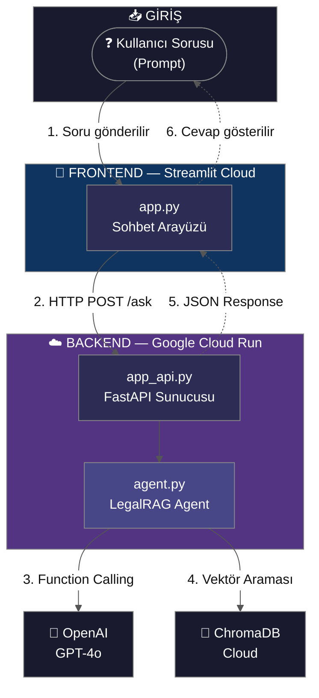
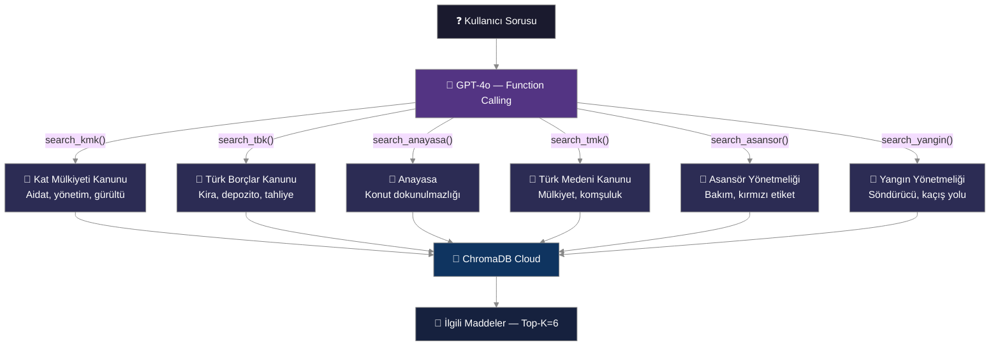
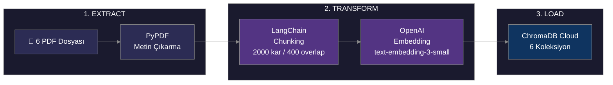
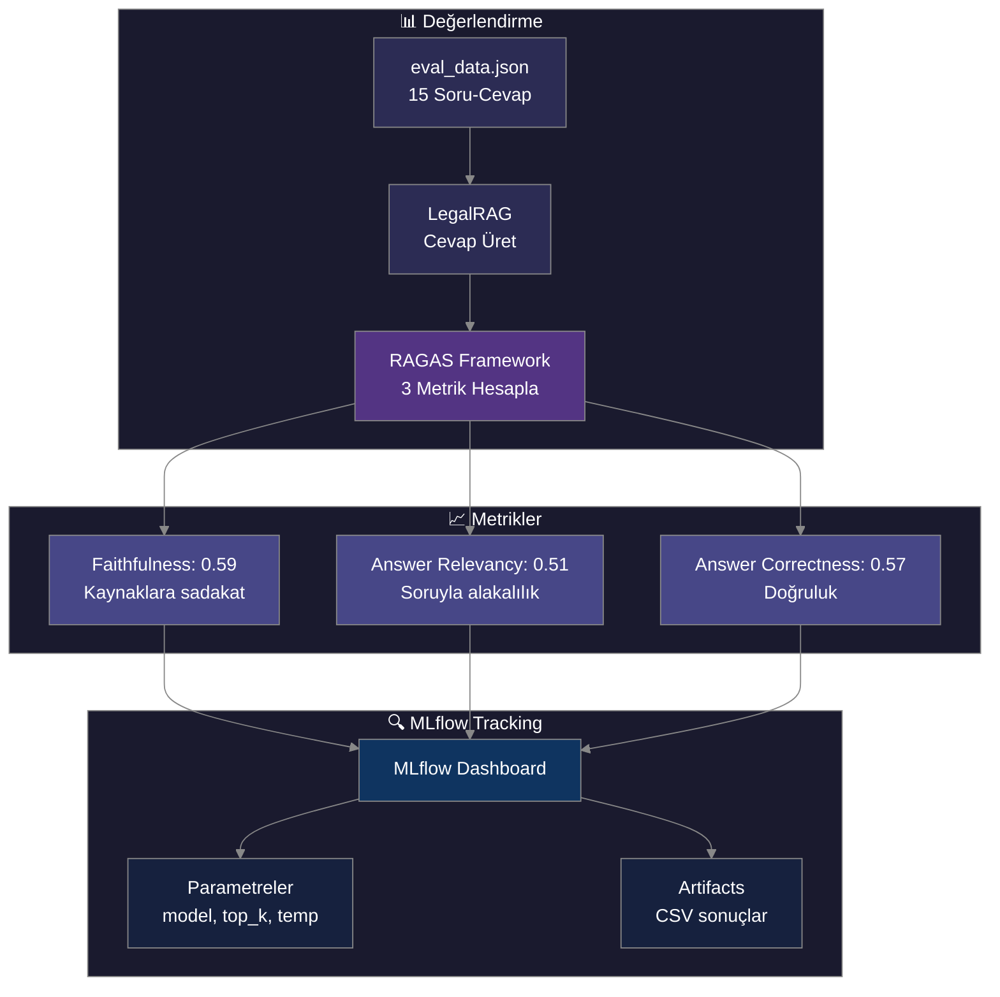
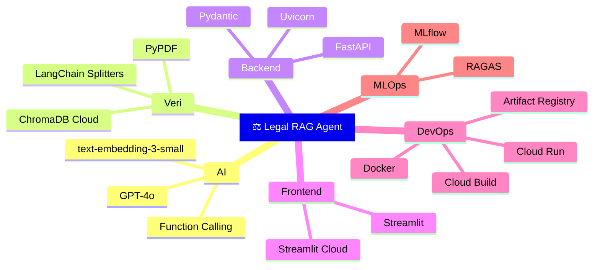
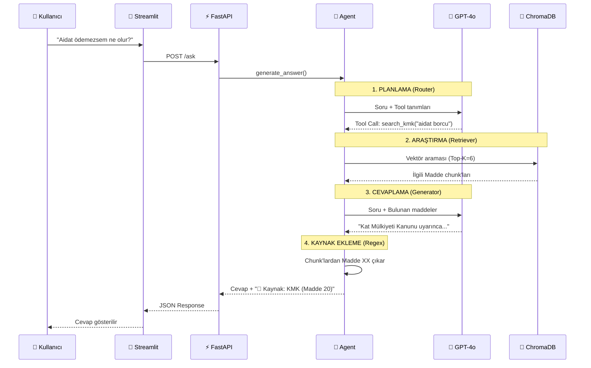

# 📊 Sunum Şemaları — Multi-Law Legal RAG Agent

---

## Sistem Mimarisi

---

## Ajan Yönlendirme Mantığı (Router)

---

## Veri Yükleme Pipeline'ı (ETL / Ingestion)

---

## 7. MLOps / Değerlendirme Pipeline'ı

---

## Tech Stack

---

## Agentic RAG Akışı (Core Pipeline)

