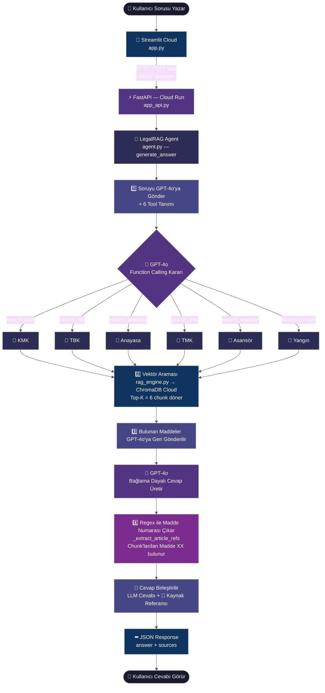
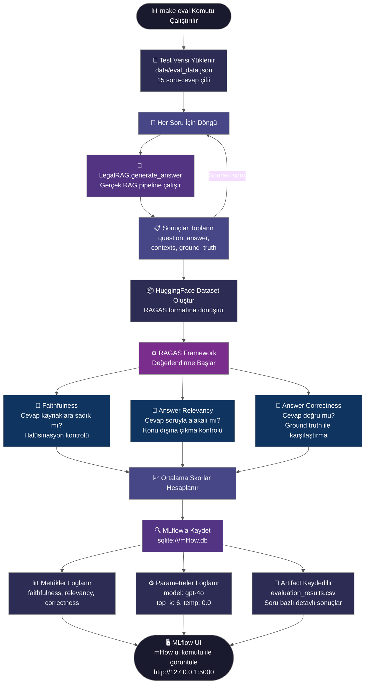

# 🔄 Sistem Akış Şemaları

---

## 1. Kullanıcı Sorusu Geldiğinde Sistem Nasıl Çalışır?

```mermaid
%%{init: {'theme': 'base', 'themeVariables': {'lineColor': '#555', 'primaryTextColor': '#fff'}}}%%
flowchart TD
    START(["👤 Kullanıcı Sorusu Yazar"])

    START --> UI["🎨 Streamlit Cloud<br/>app.py"]
    UI -->|"HTTP POST /ask<br/>JSON: question"| API["⚡ FastAPI — Cloud Run<br/>app_api.py"]

    API --> AGENT["🧠 LegalRAG Agent<br/>agent.py — generate_answer"]

    AGENT --> STEP1["1️⃣ Soruyu GPT-4o'ya Gönder<br/>+ 6 Tool Tanımı"]
    STEP1 --> GPT1{"🤖 GPT-4o<br/>Function Calling Kararı"}

    GPT1 -->|"search_kmk"| T1["📕 KMK"]
    GPT1 -->|"search_tbk"| T2["📗 TBK"]
    GPT1 -->|"search_anayasa"| T3["📘 Anayasa"]
    GPT1 -->|"search_tmk"| T4["📙 TMK"]
    GPT1 -->|"search_asansor"| T5["📓 Asansör"]
    GPT1 -->|"search_yangin"| T6["📔 Yangın"]

    T1 --> SEARCH
    T2 --> SEARCH
    T3 --> SEARCH
    T4 --> SEARCH
    T5 --> SEARCH
    T6 --> SEARCH

    SEARCH["2️⃣ Vektör Araması<br/>rag_engine.py → ChromaDB Cloud<br/>Top-K = 6 chunk döner"]

    SEARCH --> CONTEXT["3️⃣ Bulunan Maddeler<br/>GPT-4o'ya Geri Gönderilir"]
    CONTEXT --> GPT2["🤖 GPT-4o<br/>Bağlama Dayalı Cevap Üretir"]

    GPT2 --> REGEX["4️⃣ Regex ile Madde Numarası Çıkar<br/>_extract_article_refs<br/>Chunk'lardan Madde XX bulunur"]

    REGEX --> COMBINE["📝 Cevap Birleştirilir<br/>LLM Cevabı + 📌 Kaynak Referansı"]

    COMBINE --> RESPONSE["⬅️ JSON Response<br/>answer + sources"]
    RESPONSE --> DISPLAY(["👤 Kullanıcı Cevabı Görür"])

    style START fill:#1a1a2e,stroke:#888,color:#fff
    style UI fill:#0f3460,stroke:#888,color:#fff
    style API fill:#533483,stroke:#888,color:#fff
    style AGENT fill:#2c2c54,stroke:#888,color:#fff
    style STEP1 fill:#474787,stroke:#888,color:#fff
    style GPT1 fill:#533483,stroke:#888,color:#fff
    style T1 fill:#2c2c54,stroke:#888,color:#fff
    style T2 fill:#2c2c54,stroke:#888,color:#fff
    style T3 fill:#2c2c54,stroke:#888,color:#fff
    style T4 fill:#2c2c54,stroke:#888,color:#fff
    style T5 fill:#2c2c54,stroke:#888,color:#fff
    style T6 fill:#2c2c54,stroke:#888,color:#fff
    style SEARCH fill:#0f3460,stroke:#888,color:#fff
    style CONTEXT fill:#474787,stroke:#888,color:#fff
    style GPT2 fill:#533483,stroke:#888,color:#fff
    style REGEX fill:#7b2d8e,stroke:#888,color:#fff
    style COMBINE fill:#474787,stroke:#888,color:#fff
    style RESPONSE fill:#0f3460,stroke:#888,color:#fff
    style DISPLAY fill:#1a1a2e,stroke:#888,color:#fff
```

---

## 2. MLOps Pipeline'ı Nasıl Çalışır?

```mermaid
%%{init: {'theme': 'base', 'themeVariables': {'lineColor': '#555', 'primaryTextColor': '#fff'}}}%%
flowchart TD
    START(["📊 make eval Komutu Çalıştırılır"])

    START --> LOAD["📂 Test Verisi Yüklenir<br/>data/eval_data.json<br/>15 soru-cevap çifti"]

    LOAD --> LOOP["🔁 Her Soru İçin Döngü"]

    LOOP --> RAG["🧠 LegalRAG.generate_answer<br/>Gerçek RAG pipeline çalışır"]
    RAG --> COLLECT["📋 Sonuçlar Toplanır<br/>question, answer,<br/>contexts, ground_truth"]
    COLLECT -->|"Sonraki soru"| LOOP

    COLLECT --> DATASET["📦 HuggingFace Dataset Oluştur<br/>RAGAS formatına dönüştür"]

    DATASET --> RAGAS["⚙️ RAGAS Framework<br/>Değerlendirme Başlar"]

    RAGAS --> M1["📏 Faithfulness<br/>Cevap kaynaklara sadık mı?<br/>Halüsinasyon kontrolü"]
    RAGAS --> M2["📏 Answer Relevancy<br/>Cevap soruyla alakalı mı?<br/>Konu dışına çıkma kontrolü"]
    RAGAS --> M3["📏 Answer Correctness<br/>Cevap doğru mu?<br/>Ground truth ile karşılaştırma"]

    M1 --> SCORES["📈 Ortalama Skorlar Hesaplanır"]
    M2 --> SCORES
    M3 --> SCORES

    SCORES --> MLFLOW["🔍 MLflow'a Kaydet<br/>sqlite:///mlflow.db"]

    MLFLOW --> LOG_M["📊 Metrikler Loglanır<br/>faithfulness, relevancy, correctness"]
    MLFLOW --> LOG_P["⚙️ Parametreler Loglanır<br/>model: gpt-4o<br/>top_k: 6, temp: 0.0"]
    MLFLOW --> LOG_A["📎 Artifact Kaydedilir<br/>evaluation_results.csv<br/>Soru bazlı detaylı sonuçlar"]

    LOG_M --> DASHBOARD(["🖥️ MLflow UI<br/>mlflow ui komutu ile görüntüle<br/>http://127.0.0.1:5000"])
    LOG_P --> DASHBOARD
    LOG_A --> DASHBOARD

    style START fill:#1a1a2e,stroke:#888,color:#fff
    style LOAD fill:#2c2c54,stroke:#888,color:#fff
    style LOOP fill:#474787,stroke:#888,color:#fff
    style RAG fill:#533483,stroke:#888,color:#fff
    style COLLECT fill:#474787,stroke:#888,color:#fff
    style DATASET fill:#2c2c54,stroke:#888,color:#fff
    style RAGAS fill:#7b2d8e,stroke:#888,color:#fff
    style M1 fill:#0f3460,stroke:#888,color:#fff
    style M2 fill:#0f3460,stroke:#888,color:#fff
    style M3 fill:#0f3460,stroke:#888,color:#fff
    style SCORES fill:#474787,stroke:#888,color:#fff
    style MLFLOW fill:#533483,stroke:#888,color:#fff
    style LOG_M fill:#2c2c54,stroke:#888,color:#fff
    style LOG_P fill:#2c2c54,stroke:#888,color:#fff
    style LOG_A fill:#2c2c54,stroke:#888,color:#fff
    style DASHBOARD fill:#1a1a2e,stroke:#888,color:#fff
```
